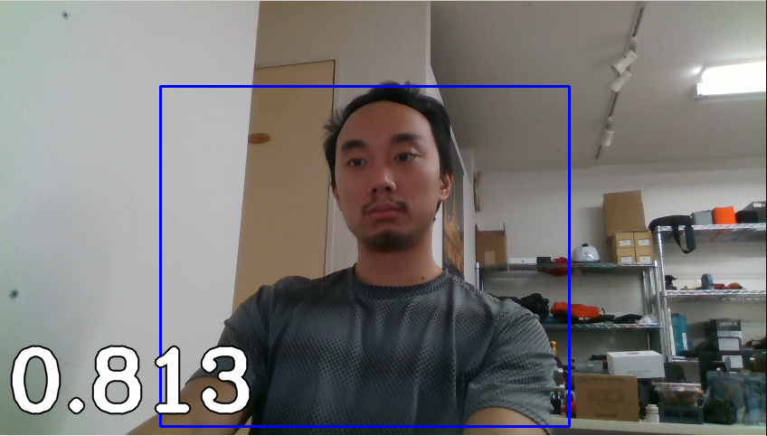

# human-detection

This is a simple combination of Darknet Object Detection YOLOv3 and IntelRealsennse D435. This project is to use pretrained weight from yolov3-tiny and detect only person class, measure the distance between camera to detected human then shows the value in meter as the picture.

# Installation

You must have the libIntelRealsense and Darknet installed on your machine.

# Run
Just go into this directory and hit `python3 humanDetection.py` if there is no error you should see the Detected! windor pop ups.
